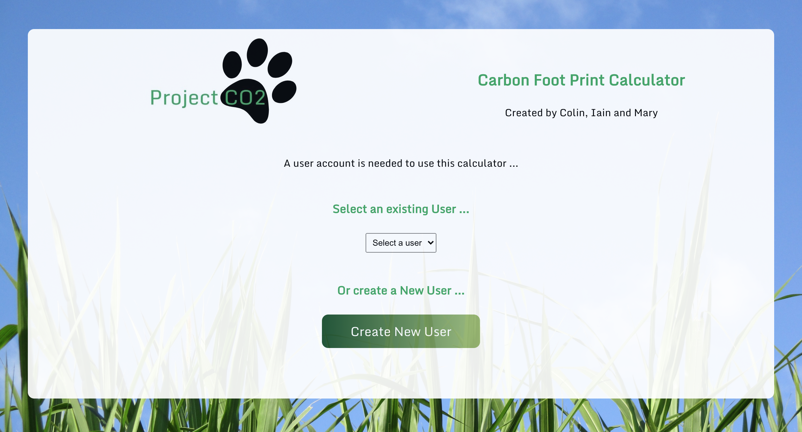

# PROJECT CO2

## Project Brief
You have been approached by a lifestyle consultancy compamy dealing with environmental sustainability. Your task is to build a personal CO2 Footprint checker app that calculates a users CO2 Footprint based on their lifestyle.

## Technologies Used

### App Development
* MongoDB
* Express.js
* React.js
* Node.js 

## Testing
* Cypress
* Mocha 

# Instructions to View the App

1. Pull the Repo from GitHub
2. In the terminal access the project's server folder - server.
3. Install the npm packages. 

### `npm install`

4. Running the server on  [http://localhost:5000](http://localhost:5000) 

### `npm run server:dev`

5. In a new terminal window again access the server folder - server.
6. Run the seeds file.

### `npm run seeds.js`

7. In a new server window access the client folder - client. 
8. Install the npm packages. 

### `npm install`

9. Running the server on  [http://localhost:3000](http://localhost:3000) 

### `npm start`

## Running Cypress Testing

1. From the main app folder start up the Cypress Testing environment by running the following in the terminal ...

### `npm run tests:e2e`

### `npm run build`

# App Screenshots

 

